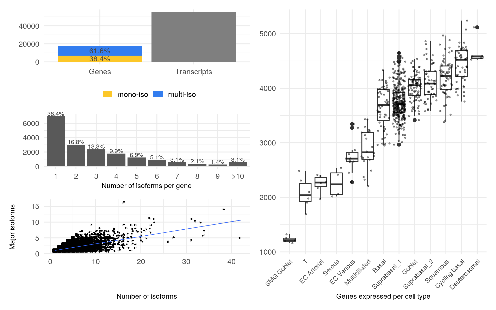
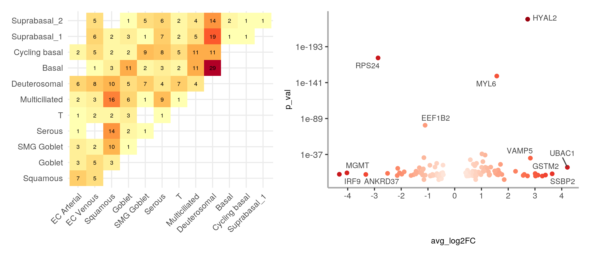
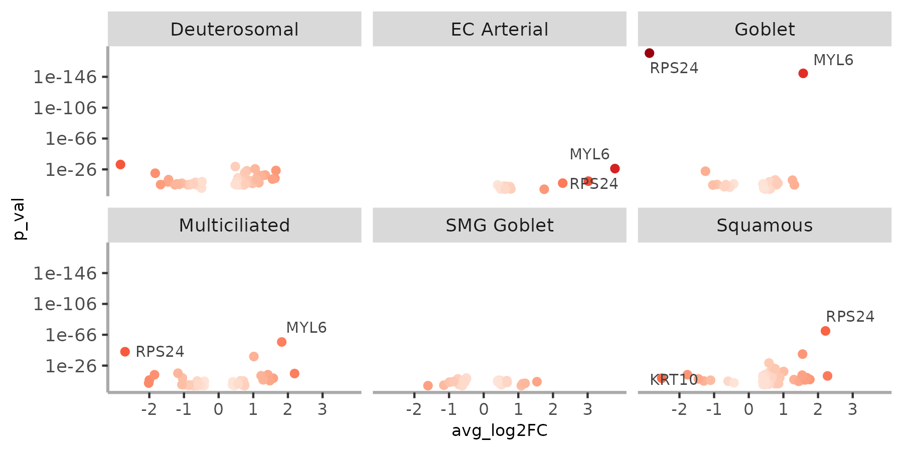
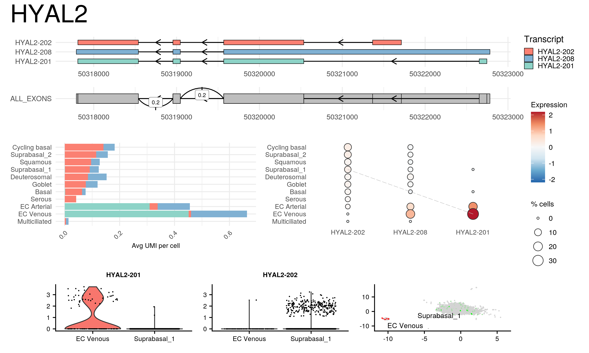

<!-- README.md is generated from README.Rmd. Please edit that file -->

```{r, include = FALSE}
knitr::opts_chunk$set(
  collapse = TRUE,
  comment = "#>",
  fig.path = "man/figures/README-",
  out.width = "100%"
)

# test data
library(dplyr)
library(isoswitch)
seurat <- readRDS("/data/10x_data/10x_5psanger/output/adult50.rds")

```

# isoswitch

<!-- badges: start -->
<!-- badges: end -->

The goal of isoswitch is to facilitate the characterization of isoform expression in long-read single-cell datasets
It includes a set of functions and reports built on top of Seurat, ggplot and rmarkdown that can be used to search, visualize and document isoform expression patterns, and particularly isoform switches between cell identities.


## Installation

You can install the development version of isoswitch from [GitHub](https://github.com/) with:

``` r
# install.packages("devtools")
devtools::install_github("atienza-ipmc/isoswitch")
```

## General Workflow 

1. Input data setup & pre-processing
2. Isoform characterization
3. Isoform switch detection
4. Gene reports

Below is a short overview of the package functionality:

### 1 - Input data setup & pre-processing

Isoswitch is designed to work with `Seurat` objects with gene- and isoform-level counts.   

In particular, the ScNaUmi-seq protocol (Lebrigand et al 2020) generates two matrix 
counts that need to be loaded into respective Seurat assays before starting the 
analysis, more specifically:

- A gene-level [gene x cell] matrix count, generated by 10X CellRanger pipeline. Typically stored in assay "RNA" in Seurat object.
- An isoform-level [isoform x cell] matrix count generated by SiCeLoRe pipeline, stored in a separate "isoform" assay.

> **Note**
> isoswith expects the row names of the isoform count matrix to follow the format "[gene_name]..[transcript_id]", example: "BCS1L..ENST00000359273"

```{r echo=TRUE, warning=FALSE}
head(rownames(seurat@assays$multi@counts))
```

After loading up gene- and isoform- counts, the method `iso_preprocess()` prepares
the isoform matrix by removing low-expression transcripts compared to the total
expression of the gene (percentage threshold is given as parameter), as well as 
removingsingle-isoform genes which are irrelevant for the isoform switch analysis. 
The resulting "multi-isoform" matrix is stored as a new assay on the input Seurat object.

```{r echo=TRUE, eval=FALSE}
seurat <- iso_preprocess(seurat, assay="ISO", new_assay="multi", filter_threshold=5)
```
 


### 2. Isoform characterization

The method `iso_compute_stats()` parses the isoform raw count matrix returning
a data frame with stats on the expression of each transcript 

* `feature`, `gene_id`, `transcript_id` gene/transcript identifiers
* `sum` Total UMI counts for the transcript
* `total_gene` Total UMI counts for the gene
* `n_isofs` Number of distinct isoforms detected for the gene
* `max_sum` Max sum value for the isoform with the highest expression
* `perc` Relative percentage of isoform UMI count vs gene total.
* `is_major` (Boolean) is this considered a major isoform
* `is_top` (Boolean) is this highest expressed isoform

```{r echo=TRUE, warning=FALSE}
stats <- iso_compute_stats(seurat@assays$multi@counts) %>% arrange(gene_id)
head(stats, n=4)
```

The method `plot_assay_stats()` builds on this data to plot a summary with number
of genes, number of transcripts, distribution of isoforms and number of genes per 
cell type that can be used to describe succintly the isoform distribution in the 
dataset.

```{r, eval=FALSE}
plot_assay_stats(seurat, "isoform")
```



### 3. Isoform switch search

The term “isoform switch” refers to an event where two isoforms of the same gene
are considered markers of different clusters. 

The marker search is implemented on `ISO_SWITCH_ALL()` method which relies on 
Seurat's FindMarkers functionality. 

```{r, eval=FALSE}
clusters <- levels(seurat@active.ident)
switch_markers <- ISO_SWITCH_ALL(seurat, clusters, assay="isoform", min.pct=0, logfc.threshold=0.40, verbose=TRUE)
```

The result of `ISO_SWITCH_ALL()` is a data frame of transcripts considered 
statistically significant markers of certain clusters. 

The method `compute_switches()` takes a list of markers as input and combines 
them into switches ranking them by p-value.

```{r, eval=FALSE}
switches <- compute_switches(switch_markers)
```

The helper method `format_switch_table()` can be used to print a summary of 
switches for reports

Alternatively, to facilitate the graphical interpretation of the results
1.  `plot_marker_matrix()` produces a heatmap of number of unique genes per contrast between clusters 
2.  `plot_marker_score()` produces a volcano plot showing p-values and average logFC for each gene with an isoform switch   

```{r, eval=FALSE}
pl1 <- plot_marker_matrix(seurat, switch_markers) 
pl2 <- plot_marker_score(adult, switch_markers, facet=FALSE, overlaps=16)
pl1 | pl2 
```
 
Alternatively, `plot_marker_score()` can also plot faceted individual plots for each cluster analyzed

```{r, eval=FALSE}
plot_marker_score(adult, switch_markers, facet=TRUE, ncol=3)
```
 

### 4. Gene reports

After identifying genes of interest, two methods are implemented to produce gene-level reports:

* The `isoswitch_report()` method produces a compact plot of the gene 

```{r, eval=FALSE}
isoswitch_report(seurat, "isoform", gene="HYAL2", marker_list=switch_markers) 
```
 
*  Alternatively, the `render_html_gene_report()` method renders an [html version](https://www.isomics.eu/reports/fetal/genes/C3_CD36.nb.html)
