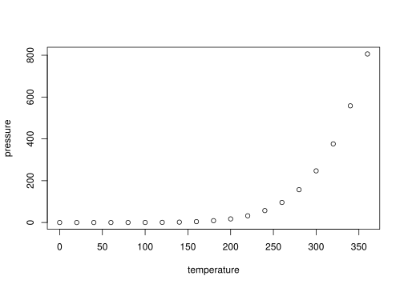

<!-- README.md is generated from README.Rmd. Please edit that file -->

# isoswitch

<!-- badges: start -->

<!-- badges: end -->

The goal of isoswitch is to facilitate the characterization of isoform
expression in long-read single-cell datasets (ScNaUmi-seq, Lebrigand et
al 2020). It includes a set of functions built on top of Seurat and
ggplot that can be used to search, visualize and document isoform switch
patterns.

## Installation

You can install the development version of isoswitch from
[GitHub](https://github.com/) with:

``` r
# install.packages("devtools")
devtools::install_github("atienza-ipmc/isoswitch")
```

## General Workflow

1.  Input data / object setup
2.  Isoform characterization
3.  Switch search
4.  Gene reports

Below is a short introduction to the use of the package using a

### 1 - Input data / object setup

Isoswitch works with Seurat objects with gene- and isoform-level counts.

  - A standard gene-level “RNA” assay, with \[gene x cell\] matrix count
  - An isoform-level with \[isoform x cell\] matrix counts, By
    convention, the row names of the isoform count matrix follow the
    format “<gene_name>..<transcript_id> -\>”BCS1L..ENST00000359273"

### 2\. Isoform characterization

The method **iso\_compute\_stats** parses the isoform raw count matrix
and returns a data frame with the following structure:

``` r
stats <- iso_compute_stats(seurat@assays$multi@counts) %>% arrange(gene_id)
#> Warning in iso_compute_stats(seurat@assays$multi@counts): features with 0
#> expression found in matrix
head(stats, n=4)
#>                 feature gene_id   transcript_id sum total_gene n_isofs max_sum
#> 1 A1BG..ENST00000596924    A1BG ENST00000596924   5          8       2       5
#> 2 A1BG..ENST00000598345    A1BG ENST00000598345   3          8       2       5
#> 3  A2M..ENST00000495709     A2M ENST00000495709  10         14       2      10
#> 4  A2M..ENST00000318602     A2M ENST00000318602   4         14       2      10
#>       perc is_major is_top
#> 1 62.50000     TRUE   TRUE
#> 2 37.50000     TRUE  FALSE
#> 3 71.42857     TRUE   TRUE
#> 4 28.57143    FALSE  FALSE
```

The method **plot\_assay\_stats** builds on this data to plot a summary
with number of genes, number of transcripts, distribution of isoforms
and number of genes per cell type.

``` r
plot_assay_stats(seurat, "isoform")
```


Counts

that containsic example which shows you how to solve a common problem:

``` r
library(isoswitch)
## basic example code
```

What is special about using `README.Rmd` instead of just `README.md`?
You can include R chunks like so:

``` r
summary(cars)
#>      speed           dist       
#>  Min.   : 4.0   Min.   :  2.00  
#>  1st Qu.:12.0   1st Qu.: 26.00  
#>  Median :15.0   Median : 36.00  
#>  Mean   :15.4   Mean   : 42.98  
#>  3rd Qu.:19.0   3rd Qu.: 56.00  
#>  Max.   :25.0   Max.   :120.00
```

You’ll still need to render `README.Rmd` regularly, to keep `README.md`
up-to-date. `devtools::build_readme()` is handy for this. You could also
use GitHub Actions to re-render `README.Rmd` every time you push. An
example workflow can be found here:
<https://github.com/r-lib/actions/tree/v1/examples>.

You can also embed plots, for example:



In that case, don’t forget to commit and push the resulting figure
files, so they display on GitHub and CRAN.
